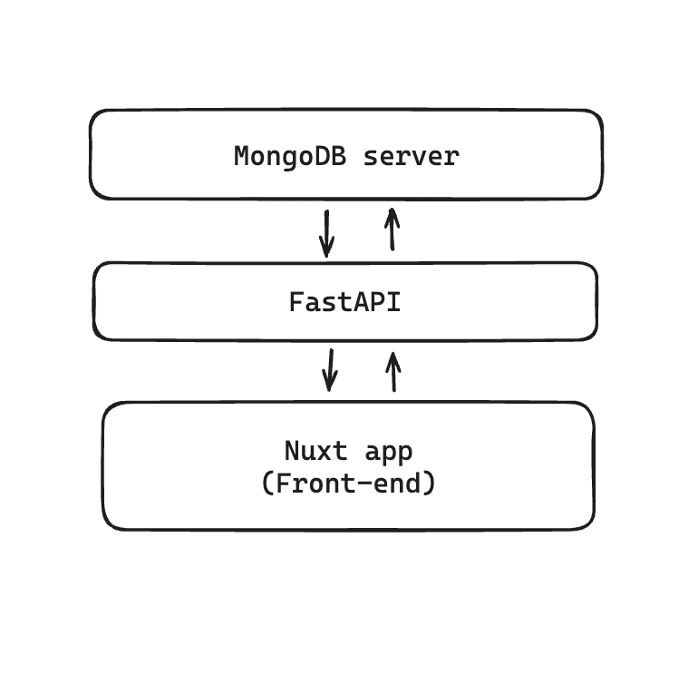

> [!WARNING]  
> Vercel link currently does not function as the API is currently undergoing production deployment attempts. API seems
> to be too big to be hosted serverless without incurring any extra costs from my end. Woops!

# top-250-website
Website-hosted dashboard showing analysis of the Top 250 Filipino Movies of all time.

For curious developers and data enthusiasts, I've set-up a couple of guides that you can access below to understand how I
arrived at this project.

### API Reference
As of July 2, 2024, I moved the API to a separate file so that it would be easier to manage the project considering the eventual scale of the project.

You're free to access it [here](https://github.com/jmcruz14/lboxd-list-api).

### Guides
- [Docker Setup](/docs/docker_setup.md)
- Fast API (Coming soon)


### Instructions for activating (dev-only)
1. Save as shell script something like `run_fastapi.sh`.
2. In `run_fastapi.sh`,

```bash
uvicorn main:app --reload
```
Be sure that the uvicorn (Python Web Server implementation) is installed before executing the script.

3. (Optional) To make easier execution, execute the following query in the terminal. This adds an execute permission to the file.
```bash
chmod +x ./run_fastapi.sh
```
This will allow run_fastapi.sh, which is installed in your project's working folder, to be executed when typing said file down as it has an execute permission.

### Version
```
    0.0.1
```

### Changelogs
```
    Coming soon!
```

### Pipeline Model


The back-end consists of an API built using Python's FastAPI and points to the MongoDB database. The front-end is powered via Vue.js (Nuxt) which interacts with the API to retrieve data that will be shown on the front-end.

<hr>

# Nuxt 3 Minimal Starter

Look at the [Nuxt 3 documentation](https://nuxt.com/docs/getting-started/introduction) to learn more.

## Setup

Make sure to install the dependencies:

```bash
# npm
npm install

# pnpm
pnpm install

# yarn
yarn install

# bun
bun install
```

## Development Server

Start the development server on `http://localhost:3000`:

```bash
# npm
npm run dev

# pnpm
pnpm run dev

# yarn
yarn dev

# bun
bun run dev
```

## Production

Build the application for production:

```bash
# npm
npm run build

# pnpm
pnpm run build

# yarn
yarn build

# bun
bun run build
```

Locally preview production build:

```bash
# npm
npm run preview

# pnpm
pnpm run preview

# yarn
yarn preview

# bun
bun run preview
```

Check out the [deployment documentation](https://nuxt.com/docs/getting-started/deployment) for more information.

<hr>

#### Authors
Jay Cruz
